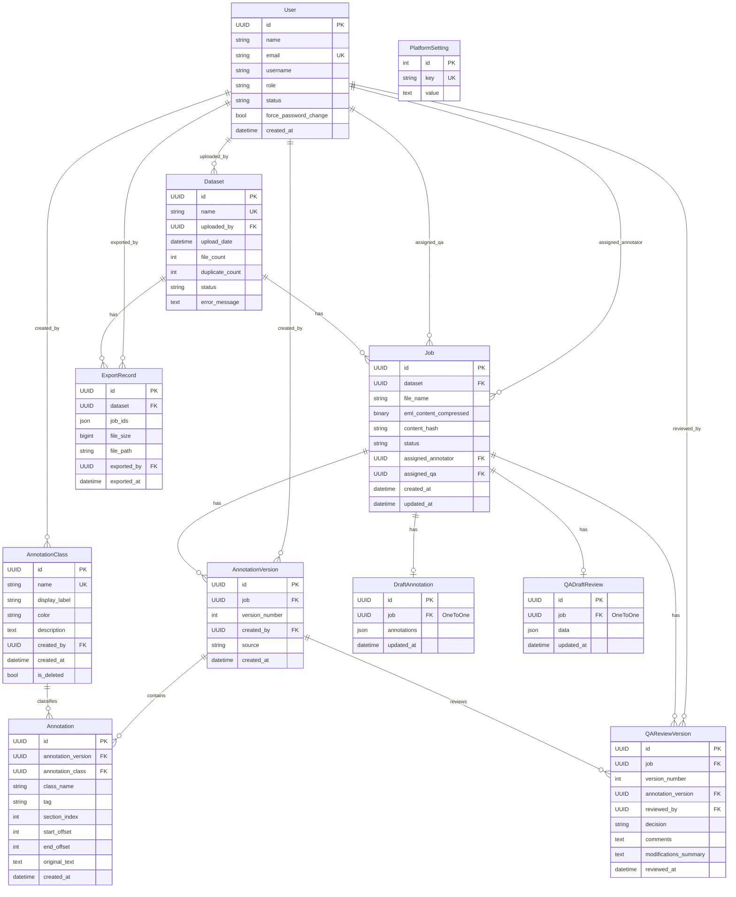

# Database Design

## Overview

PostgreSQL database (`email_annotation`) backing the Email PII De-Identification Annotation Platform. All models use **UUID primary keys** and session-based authentication.

**10 models across 6 Django apps:**

| App | Models | Purpose |
|-----|--------|---------|
| `accounts` | User | Authentication and RBAC |
| `datasets` | Dataset, Job | Email file ingestion and job lifecycle |
| `core` | AnnotationClass, PlatformSetting | Shared annotation taxonomy and platform config |
| `annotations` | AnnotationVersion, Annotation, DraftAnnotation | Annotator-created PII labels |
| `qa` | QAReviewVersion, QADraftReview | QA review decisions |
| `exports` | ExportRecord | De-identified export history |

> The `history` and `dashboard` apps are **view-only** — they query existing models but define no tables of their own.

---

## Entity-Relationship Diagram



---

## Models by App

### 1. accounts — `User`

Custom user model extending Django's `AbstractUser`. Email is the login identifier.

| Field | Type | Constraints | Notes |
|-------|------|-------------|-------|
| `id` | `UUIDField` | PK, default `uuid4` | |
| `name` | `CharField(255)` | required | Display name |
| `email` | `EmailField` | **unique** | `USERNAME_FIELD` — used for login |
| `username` | `CharField(150)` | blank, default `""` | Kept for AbstractUser compat; uniqueness only enforced when non-empty |
| `role` | `CharField(20)` | choices: `ADMIN`, `ANNOTATOR`, `QA` | Default: `ANNOTATOR` |
| `status` | `CharField(20)` | choices: `ACTIVE`, `INACTIVE` | Default: `ACTIVE` |
| `force_password_change` | `BooleanField` | | Default: `False` |
| `created_at` | `DateTimeField` | auto_now_add | |

**Inherited from AbstractUser:** `password`, `last_login`, `is_superuser`, `is_staff`, `is_active`, `date_joined`, plus group/permission M2M relations.

**Constraints:**
- `unique_username_nonempty` — unique on `username` only when `username != ""` (conditional unique constraint).

**Manager:** Custom `UserManager` that normalizes email and sets `username = email` by default.

---

### 2. datasets — `Dataset`, `Job`

#### Dataset

Represents an uploaded ZIP of `.eml` files.

| Field | Type | Constraints | Notes |
|-------|------|-------------|-------|
| `id` | `UUIDField` | PK | |
| `name` | `CharField(255)` | **unique** | Dataset display name |
| `uploaded_by` | `ForeignKey(User)` | nullable, `SET_NULL` | Related name: `uploaded_datasets` |
| `upload_date` | `DateTimeField` | auto_now_add | |
| `file_count` | `IntegerField` | | Default: `0` |
| `duplicate_count` | `IntegerField` | | Default: `0` — files skipped due to content_hash match |
| `status` | `CharField(20)` | choices: `UPLOADING`, `EXTRACTING`, `READY`, `FAILED` | Default: `UPLOADING` |
| `error_message` | `TextField` | blank | Populated when status = `FAILED` |

#### Job

One job per `.eml` file extracted from a dataset. Central entity driving the annotation workflow.

| Field | Type | Constraints | Notes |
|-------|------|-------------|-------|
| `id` | `UUIDField` | PK | |
| `dataset` | `ForeignKey(Dataset)` | `CASCADE` | Related name: `jobs` |
| `file_name` | `CharField(255)` | | Original `.eml` filename |
| `eml_content_compressed` | `BinaryField` | blank | zlib-compressed UTF-8 email content |
| `content_hash` | `CharField(64)` | **db_index** | SHA-256 hash for deduplication |
| `status` | `CharField(30)` | choices (9 values) | Default: `UPLOADED` |
| `assigned_annotator` | `ForeignKey(User)` | nullable, `SET_NULL` | Related name: `annotator_jobs` |
| `assigned_qa` | `ForeignKey(User)` | nullable, `SET_NULL` | Related name: `qa_jobs` |
| `created_at` | `DateTimeField` | auto_now_add | |
| `updated_at` | `DateTimeField` | auto_now | |

**Job status lifecycle:**

```
UPLOADED → ASSIGNED_ANNOTATOR → ANNOTATION_IN_PROGRESS → SUBMITTED_FOR_QA
    → ASSIGNED_QA → QA_IN_PROGRESS → QA_ACCEPTED → DELIVERED
                                    ↘ QA_REJECTED (→ back to ANNOTATION_IN_PROGRESS)
```

**Property:** `eml_content` — Python property that transparently compresses/decompresses via `zlib`, keeping the raw column as binary.

---

### 3. core — `AnnotationClass`, `PlatformSetting`

#### AnnotationClass

PII taxonomy labels (e.g., "Person Name", "Email Address") used to classify annotations.

| Field | Type | Constraints | Notes |
|-------|------|-------------|-------|
| `id` | `UUIDField` | PK | |
| `name` | `CharField(100)` | **unique** | Machine-readable identifier |
| `display_label` | `CharField(100)` | | Human-readable label |
| `color` | `CharField(7)` | | Hex color code (e.g., `#FF5733`) |
| `description` | `TextField` | blank | |
| `created_by` | `ForeignKey(User)` | nullable, `SET_NULL` | Related name: `created_annotation_classes` |
| `created_at` | `DateTimeField` | auto_now_add | |
| `is_deleted` | `BooleanField` | | Default: `False` — **soft delete** flag |

**Soft delete:** Records are never hard-deleted. Queries filter `is_deleted=False` in business logic.

#### PlatformSetting

Key-value store for global platform configuration.

| Field | Type | Constraints | Notes |
|-------|------|-------------|-------|
| `id` | `AutoField` | PK | Default Django auto-increment (not UUID) |
| `key` | `CharField(100)` | **unique** | Setting identifier (e.g., `blind_review_enabled`) |
| `value` | `TextField` | blank | Setting value stored as text |

---

### 4. annotations — `AnnotationVersion`, `Annotation`, `DraftAnnotation`

#### AnnotationVersion

Immutable snapshot of a submitted annotation set. A new version is created each time an annotator (or QA reviewer) submits.

| Field | Type | Constraints | Notes |
|-------|------|-------------|-------|
| `id` | `UUIDField` | PK | |
| `job` | `ForeignKey(Job)` | `CASCADE` | Related name: `annotation_versions` |
| `version_number` | `PositiveIntegerField` | | Monotonically increasing per job |
| `created_by` | `ForeignKey(User)` | nullable, `SET_NULL` | Related name: `annotation_versions` |
| `source` | `CharField(20)` | choices: `ANNOTATOR`, `QA` | Who created this version |
| `created_at` | `DateTimeField` | auto_now_add | |

**Constraints:**
- `unique_together: [job, version_number]` — ensures version numbers are unique per job.

#### Annotation

Individual PII span annotation within a version. Uses **section-based offsets** — each annotation targets a specific section of the parsed email.

| Field | Type | Constraints | Notes |
|-------|------|-------------|-------|
| `id` | `UUIDField` | PK | |
| `annotation_version` | `ForeignKey(AnnotationVersion)` | `CASCADE` | Related name: `annotations` |
| `annotation_class` | `ForeignKey(AnnotationClass)` | nullable, `SET_NULL` | Related name: `annotations` |
| `class_name` | `CharField(100)` | | Denormalized class name (preserved if class is deleted) |
| `tag` | `CharField(100)` | blank | User-defined sub-label (e.g., "Sender", "Recipient") |
| `section_index` | `IntegerField` | | Default: `0` — index into the email's section array |
| `start_offset` | `IntegerField` | | Character offset within the section (inclusive) |
| `end_offset` | `IntegerField` | | Character offset within the section (exclusive) |
| `original_text` | `TextField` | | The selected text span |
| `created_at` | `DateTimeField` | auto_now_add | |

**Offset model:** Offsets are relative to the section's content with `\r` characters stripped. The backend's `section_reassembler.py` maps these back to original CRLF positions during export.

#### DraftAnnotation

Auto-saved work-in-progress for the annotator. One draft per job (replaced on each save).

| Field | Type | Constraints | Notes |
|-------|------|-------------|-------|
| `id` | `UUIDField` | PK | |
| `job` | `OneToOneField(Job)` | `CASCADE` | Related name: `draft_annotation` |
| `annotations` | `JSONField` | | Default: `[]` — list of annotation objects |
| `updated_at` | `DateTimeField` | auto_now | |

---

### 5. qa — `QAReviewVersion`, `QADraftReview`

#### QAReviewVersion

Immutable record of a QA reviewer's accept/reject decision on an annotation version.

| Field | Type | Constraints | Notes |
|-------|------|-------------|-------|
| `id` | `UUIDField` | PK | |
| `job` | `ForeignKey(Job)` | `CASCADE` | Related name: `qa_reviews` |
| `version_number` | `PositiveIntegerField` | | QA review version, independent of annotation version |
| `annotation_version` | `ForeignKey(AnnotationVersion)` | `CASCADE` | Related name: `qa_reviews` — the annotation version under review |
| `reviewed_by` | `ForeignKey(User)` | nullable, `SET_NULL` | Related name: `qa_reviews` |
| `decision` | `CharField(10)` | choices: `ACCEPT`, `REJECT` | |
| `comments` | `TextField` | blank | Reviewer notes |
| `modifications_summary` | `TextField` | blank | Summary of changes made by QA |
| `reviewed_at` | `DateTimeField` | auto_now_add | |

**Constraints:**
- `unique_together: [job, version_number]` — ensures QA review version numbers are unique per job.

#### QADraftReview

Auto-saved work-in-progress for the QA reviewer. One draft per job.

| Field | Type | Constraints | Notes |
|-------|------|-------------|-------|
| `id` | `UUIDField` | PK | |
| `job` | `OneToOneField(Job)` | `CASCADE` | Related name: `qa_draft_review` |
| `data` | `JSONField` | | Default: `{}` — dict of draft review state |
| `updated_at` | `DateTimeField` | auto_now | |

---

### 6. exports — `ExportRecord`

#### ExportRecord

Tracks each de-identified export generated from delivered jobs.

| Field | Type | Constraints | Notes |
|-------|------|-------------|-------|
| `id` | `UUIDField` | PK | |
| `dataset` | `ForeignKey(Dataset)` | `CASCADE` | Related name: `exports` |
| `job_ids` | `JSONField` | | Default: `[]` — list of job UUIDs included in export |
| `file_size` | `BigIntegerField` | | Default: `0` — bytes |
| `file_path` | `CharField(500)` | | Server filesystem path to the ZIP |
| `exported_by` | `ForeignKey(User)` | nullable, `SET_NULL` | Related name: `exports` |
| `exported_at` | `DateTimeField` | auto_now_add | |

---

## Relationship Summary

### Foreign Key Policies

All foreign keys to `User` use `on_delete=SET_NULL` (nullable) so deleting a user preserves data integrity. All other foreign keys use `on_delete=CASCADE` — deleting a parent cascades to children.

| Relationship | On Delete | Cardinality |
|---|---|---|
| Dataset → User (`uploaded_by`) | SET_NULL | Many-to-One |
| Job → Dataset | CASCADE | Many-to-One |
| Job → User (`assigned_annotator`) | SET_NULL | Many-to-One |
| Job → User (`assigned_qa`) | SET_NULL | Many-to-One |
| AnnotationClass → User (`created_by`) | SET_NULL | Many-to-One |
| AnnotationVersion → Job | CASCADE | Many-to-One |
| AnnotationVersion → User (`created_by`) | SET_NULL | Many-to-One |
| Annotation → AnnotationVersion | CASCADE | Many-to-One |
| Annotation → AnnotationClass | SET_NULL | Many-to-One |
| DraftAnnotation → Job | CASCADE | One-to-One |
| QAReviewVersion → Job | CASCADE | Many-to-One |
| QAReviewVersion → AnnotationVersion | CASCADE | Many-to-One |
| QAReviewVersion → User (`reviewed_by`) | SET_NULL | Many-to-One |
| QADraftReview → Job | CASCADE | One-to-One |
| ExportRecord → Dataset | CASCADE | Many-to-One |
| ExportRecord → User (`exported_by`) | SET_NULL | Many-to-One |

### Indexes

| Table | Column(s) | Type |
|-------|-----------|------|
| `User` | `email` | Unique |
| `User` | `username` (non-empty only) | Conditional unique |
| `Dataset` | `name` | Unique |
| `Job` | `content_hash` | Index (B-tree) |
| `AnnotationClass` | `name` | Unique |
| `PlatformSetting` | `key` | Unique |
| `AnnotationVersion` | `(job, version_number)` | Unique together |
| `QAReviewVersion` | `(job, version_number)` | Unique together |
| `DraftAnnotation` | `job` | Unique (OneToOne) |
| `QADraftReview` | `job` | Unique (OneToOne) |

> Django also auto-creates indexes on all foreign key columns.

---

## Architectural Notes

- **UUID primary keys everywhere** (except `PlatformSetting`) — prevents ID enumeration and allows client-side ID generation.
- **Zlib compression** on `Job.eml_content_compressed` — `.eml` files compress well (typically 60–80% reduction) and the transparent Python property hides the compression from application code.
- **Soft deletes** on `AnnotationClass` — existing annotations referencing a deleted class retain their `class_name` denormalization.
- **Immutable versions** — both `AnnotationVersion` and `QAReviewVersion` are append-only. Historical state is never mutated, enabling full audit trails via the `history` app.
- **Draft pattern** — `DraftAnnotation` and `QADraftReview` use `OneToOneField` to Job, providing auto-save without creating new versions. Drafts are ephemeral and replaced on each save.
- **Section-based offsets** — annotations reference `(section_index, start_offset, end_offset)` within a parsed email's section array, not the raw `.eml` byte stream. This isolates annotations from MIME encoding boundaries.
- **Optimistic locking** — job status transitions use `expected_status` validation at the API layer (not in models) to prevent conflicting state changes, returning HTTP 409 on mismatch.
